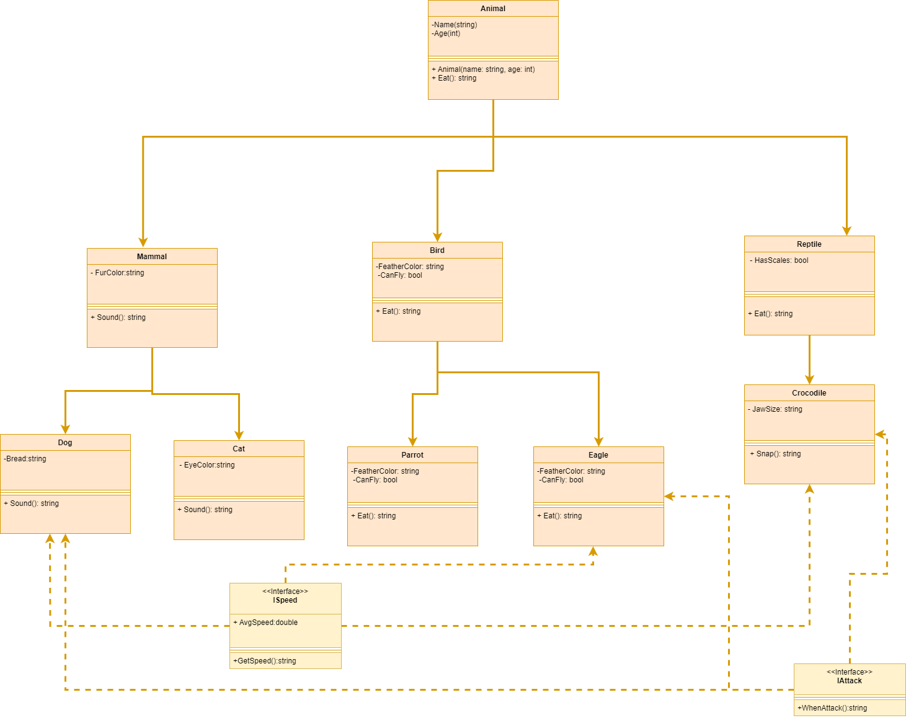

# ZOO-Lab07

## Introduction
This project is a simulation of a zoo, implemented using object-oriented programming principles in C#. It consists of various animal classes, each exhibiting different behaviors and characteristics.

## UML Diagram

## Object-Oriented Programming Principles & Examples in the zoo project

1. **Inheritance**: Inheritance allows classes to inherit properties and behaviors from their parent class.

- example from project: The `Dog` and `Cat` classes inherit from the `Mammal` class, which inherits from the `Animal` class. This allows us to reuse common attributes and methods defined in the parent classes.

2. **Encapsulation**: Encapsulation is the principle of bundling data and methods together within a class, hiding the internal details from external entities.

-  example from project: The `Animal` class encapsulates the `Name` and `Age` properties, allowing controlled access to these attributes from external code.

3. **Abstraction**: Abstraction involves representing essential features and behaviors of objects while hiding unnecessary details. We have applied abstraction by defining abstract classes and methods.

-  example from project: The `Animal` class is an abstract class that defines the `Eat()` method as an abstract method. This ensures that all concrete animal classes must implement their own version of the `Eat()` method.

4. **Polymorphism**: Polymorphism enables objects of different classes to be treated as instances of a common base class. We have leveraged polymorphism in the zoo project by overriding methods in derived classes.

- example from project: The `Sound()` method is overridden in the `Dog`, `Cat`, `Eagle`, and `Parrot` classes, providing different sound behaviors for each animal. This allows us to treat objects of these classes interchangeably as instances of the `Animal` class.

## Interfaces

An interface is a blueprint that defines a set of methods and properties that a class must implement. 
In the Zoo project, we have defined the following interfaces:

1. `ISpeed` interface:
   - Implemented by the `Dog` ,`Corcodile` and `Eagle` classes.
   - Defines the `GetSpeed()` method that returns the speed of the animal.
   - The interface is implemented toretrieve the speed of different animals in the zoo. For example, both the `Dog` and `Eagle` have different speeds, and the interface allows us to access their speeds using a common method.

2. `IAttack` interface:
   - Also Implemented by `Dog` ,`Corcodile` and `Eagle`  classes.
   - Defines the `WhenAttack()` method that describes the attack behavior of the animal.
   - The interface is implemented to represent the attack behavior of specific animals.